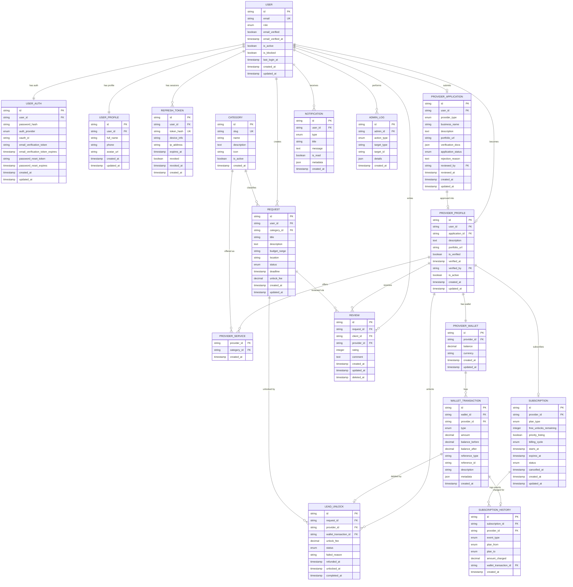

# Rabet Platform - Entity Relationship Diagram

## Project Overview

**Rabet** is a SaaS-enabled marketplace platform connecting clients and businesses in Egypt with trusted service providers (agencies). The platform operates on a **freemium + pay-per-lead** business model where:

- **Clients** post service requests for free
- **Providers** (agencies) pay a small fee to unlock and contact qualified leads
- **Admins** moderate content, verify providers, and manage platform operations

---

## Schema Design Principles

- **Single Responsibility**: Each table owns one domain of data
- **No Duplication**: Shared fields live in one place and are referenced
- **Derived Values**: Aggregates (total_spent, etc.) are computed via queries, not stored
- **Soft Deletes**: Reviews use `deleted_at` to maintain audit trail
- **Normalization**: Categories and services use a lookup table instead of free-text strings

---

## Entity Relationship Diagram



---

## 1. USER

Core identity and status. Authentication data lives in `USER_AUTH`. Display data lives in `USER_PROFILE`.

| Column            | Type      | Constraints                | Description                     |
| ----------------- | --------- | -------------------------- | ------------------------------- |
| id                | string    | PK                         | Unique user identifier (UUID)   |
| email             | string    | UK, NOT NULL               | User email address              |
| role              | enum      | NOT NULL, DEFAULT 'client' | `client`, `provider`, `admin`   |
| email_verified    | boolean   | NOT NULL, DEFAULT false    | Email verification status       |
| email_verified_at | timestamp | NULLABLE                   | When email was verified         |
| is_active         | boolean   | NOT NULL, DEFAULT true     | Account active status           |
| is_blocked        | boolean   | NOT NULL, DEFAULT false    | Admin block status              |
| last_login_at     | timestamp | NULLABLE                   | Last successful login timestamp |
| created_at        | timestamp | NOT NULL                   | Account creation time           |
| updated_at        | timestamp | NOT NULL                   | Last update time                |

**Indexes:** `email` (unique)

---

## 2. USER_AUTH

Sensitive authentication state. Separated from `USER` to isolate credentials and minimize exposure surface.

| Column                           | Type      | Constraints               | Description                                 |
| -------------------------------- | --------- | ------------------------- | ------------------------------------------- |
| id                               | string    | PK                        | Unique record identifier                    |
| user_id                          | string    | FK → USER.id, UK          | Associated user (1:1)                       |
| password_hash                    | string    | NULLABLE                  | Hashed password (null for OAuth-only users) |
| auth_provider                    | enum      | NOT NULL, DEFAULT 'local' | `local`, `google`, `facebook`, `apple`      |
| oauth_id                         | string    | NULLABLE                  | OAuth provider's user ID                    |
| email_verification_token         | string    | NULLABLE, INDEXED         | Token for email verification                |
| email_verification_token_expires | timestamp | NULLABLE                  | Expiry for verification token               |
| password_reset_token             | string    | NULLABLE, INDEXED         | Token for password reset                    |
| password_reset_expires           | timestamp | NULLABLE                  | Password reset token expiry                 |
| created_at                       | timestamp | NOT NULL                  | Record creation time                        |
| updated_at                       | timestamp | NOT NULL                  | Last update time                            |

**Indexes:**

- `user_id` (unique)
- `oauth_id + auth_provider` (composite unique for OAuth users)
- `email_verification_token`, `password_reset_token`

**Notes:**

- `password_hash` is null when user signs up via OAuth only
- Never return this record in public-facing API responses

---

## 3. USER_PROFILE

Display and contact information. Separated from `USER` to cleanly support profile editing without touching auth state.

| Column     | Type      | Constraints      | Description              |
| ---------- | --------- | ---------------- | ------------------------ |
| id         | string    | PK               | Unique record identifier |
| user_id    | string    | FK → USER.id, UK | Associated user (1:1)    |
| full_name  | string    | NOT NULL         | Display name             |
| phone      | string    | NULLABLE         | Contact phone number     |
| avatar_url | string    | NULLABLE         | Profile picture URL      |
| created_at | timestamp | NOT NULL         | Record creation time     |
| updated_at | timestamp | NOT NULL         | Last update time         |

**Indexes:** `user_id` (unique)

---

## 4. REFRESH_TOKEN

Manages JWT refresh tokens for secure token rotation and multi-session support.

| Column      | Type      | Constraints             | Description                  |
| ----------- | --------- | ----------------------- | ---------------------------- |
| id          | string    | PK                      | Unique token identifier      |
| user_id     | string    | FK → USER.id, INDEXED   | Associated user              |
| token_hash  | string    | UK, NOT NULL            | Hashed refresh token         |
| device_info | string    | NULLABLE                | User agent/device identifier |
| ip_address  | string    | NULLABLE                | IP address at token creation |
| expires_at  | timestamp | NOT NULL                | Token expiration time        |
| revoked     | boolean   | NOT NULL, DEFAULT false | Revocation status            |
| revoked_at  | timestamp | NULLABLE                | Revocation timestamp         |
| created_at  | timestamp | NOT NULL                | Token creation time          |

**Indexes:** `user_id`, `token_hash` (unique), `expires_at`

**Notes:**

- Store only hashed tokens — never raw values
- Allows revoking specific sessions ("logout from other devices")
- Clean up expired tokens periodically via cron job

---

## 5. CATEGORY

Normalized lookup table for service categories. Used by both `REQUEST` and `PROVIDER_SERVICE`.

| Column      | Type      | Constraints            | Description                      |
| ----------- | --------- | ---------------------- | -------------------------------- |
| id          | string    | PK                     | Unique category identifier       |
| slug        | string    | UK, NOT NULL           | URL-safe key (e.g. `web-design`) |
| name        | string    | NOT NULL               | Display name (e.g. "Web Design") |
| description | text      | NULLABLE               | Category description             |
| icon        | string    | NULLABLE               | Icon identifier or URL           |
| is_active   | boolean   | NOT NULL, DEFAULT true | Whether category is available    |
| created_at  | timestamp | NOT NULL               | Record creation time             |

**Indexes:** `slug` (unique), `is_active`

**Notes:**

- Single source of truth for valid categories — prevents inconsistencies like "web design" vs. "web-design"
- Admin-managed; not user-creatable

---

## 6. PROVIDER_APPLICATION

Applications submitted by clients who want to become verified providers. Source of truth for all submitted business data.

| Column             | Type      | Constraints                 | Description                          |
| ------------------ | --------- | --------------------------- | ------------------------------------ |
| id                 | string    | PK                          | Unique application identifier        |
| user_id            | string    | FK → USER.id, UK            | Applicant user (one application max) |
| provider_type      | enum      | NOT NULL                    | `agency`                             |
| business_name      | string    | NULLABLE                    | Business/agency name                 |
| description        | text      | NOT NULL                    | Provider description (min 100 chars) |
| portfolio_url      | string    | NULLABLE                    | Portfolio/website URL                |
| verification_docs  | json      | NOT NULL                    | Uploaded documents for verification  |
| application_status | enum      | NOT NULL, DEFAULT 'pending' | `pending`, `approved`, `rejected`    |
| rejection_reason   | text      | NULLABLE                    | Reason for rejection (if rejected)   |
| reviewed_by        | string    | FK → USER.id, NULLABLE      | Admin who reviewed the application   |
| reviewed_at        | timestamp | NULLABLE                    | Review completion timestamp          |
| created_at         | timestamp | NOT NULL                    | Application submission time          |
| updated_at         | timestamp | NOT NULL                    | Last update time                     |

**Indexes:** `user_id` (unique), `application_status`

**Notes:**

- `full_name` removed — read from `USER_PROFILE` via `user_id`
- On approval: `PROVIDER_PROFILE` + `PROVIDER_WALLET` are auto-created; user role updated to `provider`
- Rejected applications can be resubmitted (status reset to `pending`)

---

## 7. PROVIDER_SERVICE

Join table linking providers to categories (many-to-many). Replaces the `services string[]` array on the old profile.

| Column      | Type      | Constraints              | Description              |
| ----------- | --------- | ------------------------ | ------------------------ |
| provider_id | string    | FK → PROVIDER_PROFILE.id | Provider                 |
| category_id | string    | FK → CATEGORY.id         | Service category offered |
| created_at  | timestamp | NOT NULL                 | When service was added   |

**Primary Key:** `(provider_id, category_id)` — composite

**Indexes:** `provider_id`, `category_id`

---

## 8. PROVIDER_PROFILE

Approved provider profile. Static business data is not duplicated here — it's read from the originating `PROVIDER_APPLICATION`.

| Column         | Type      | Constraints                      | Description                      |
| -------------- | --------- | -------------------------------- | -------------------------------- |
| id             | string    | PK                               | Unique profile identifier        |
| user_id        | string    | FK → USER.id, UK                 | Associated user account          |
| application_id | string    | FK → PROVIDER_APPLICATION.id, UK | Source application               |
| description    | text      | NULLABLE                         | Live description (overridable)   |
| portfolio_url  | string    | NULLABLE                         | Live portfolio URL (overridable) |
| is_verified    | boolean   | NOT NULL, DEFAULT false          | Manual verification badge        |
| verified_at    | timestamp | NULLABLE                         | When verification was granted    |
| verified_by    | string    | FK → USER.id, NULLABLE           | Admin who granted verification   |
| is_active      | boolean   | NOT NULL, DEFAULT true           | Profile active status            |
| created_at     | timestamp | NOT NULL                         | Profile creation time            |
| updated_at     | timestamp | NOT NULL                         | Last update time                 |

**Indexes:** `user_id` (unique), `application_id` (unique), `is_verified`

**Notes:**

- `provider_type`, `business_name` — read from linked `PROVIDER_APPLICATION`
- `full_name` — read from `USER_PROFILE` via `user_id`
- `services` — queried from `PROVIDER_SERVICE` (many-to-many with `CATEGORY`)
- Created atomically with `PROVIDER_WALLET` when application is approved

---

## 9. PROVIDER_WALLET

Manages provider balance. Aggregates (`total_spent`, `total_deposited`) are removed — computed from `WALLET_TRANSACTION` on demand.

| Column      | Type      | Constraints                  | Description                  |
| ----------- | --------- | ---------------------------- | ---------------------------- |
| id          | string    | PK                           | Unique wallet identifier     |
| provider_id | string    | FK → PROVIDER_PROFILE.id, UK | Associated provider (1:1)    |
| balance     | decimal   | NOT NULL, DEFAULT 0          | Current wallet balance (EGP) |
| currency    | string    | NOT NULL, DEFAULT 'EGP'      | Wallet currency              |
| created_at  | timestamp | NOT NULL                     | Wallet creation time         |
| updated_at  | timestamp | NOT NULL                     | Last balance update time     |

**Indexes:** `provider_id` (unique)

**Notes:**

- `total_spent` / `total_deposited` removed — use `SUM(amount) WHERE type = 'debit'|'deposit'` on `WALLET_TRANSACTION`
- Balance updates use row-level locking to prevent race conditions
- Positive balance enforced via application logic before any debit

---

## 10. WALLET_TRANSACTION

Immutable audit log of all wallet operations. Every financial change must be represented here.

| Column         | Type      | Constraints                       | Description                                             |
| -------------- | --------- | --------------------------------- | ------------------------------------------------------- |
| id             | string    | PK                                | Unique transaction identifier                           |
| wallet_id      | string    | FK → PROVIDER_WALLET.id, INDEXED  | Associated wallet                                       |
| provider_id    | string    | FK → PROVIDER_PROFILE.id, INDEXED | Provider owner (denormalized for query performance)     |
| type           | enum      | NOT NULL                          | `deposit`, `debit`, `refund`, `adjustment`              |
| amount         | decimal   | NOT NULL                          | Positive = credit, negative = debit                     |
| balance_before | decimal   | NOT NULL                          | Wallet balance before transaction                       |
| balance_after  | decimal   | NOT NULL                          | Wallet balance after transaction                        |
| reference_type | string    | NULLABLE                          | `lead_unlock`, `subscription`, `top_up`                 |
| reference_id   | string    | NULLABLE, INDEXED                 | ID of related entity                                    |
| description    | string    | NULLABLE                          | Human-readable description                              |
| metadata       | json      | NULLABLE                          | Payment provider details (GDPR compliant, no card data) |
| created_at     | timestamp | NOT NULL                          | Transaction timestamp (immutable)                       |

**Indexes:**

- `wallet_id + created_at`
- `provider_id + created_at`
- `reference_type + reference_id`

**Notes:**

- Records are **immutable** — never updated, only inserted
- `balance_before/after` ensure full auditability even without wallet state
- metadata example for deposits:
  ```json
  {
    "payment_provider": "paymob",
    "external_transaction_id": "paymob_txn_123",
    "payment_method": "card",
    "card_last_four": "4242",
    "card_brand": "visa"
  }
  ```

---

## 11. REQUEST

Service requests posted by clients. Client contact info is hidden until unlocked.

| Column       | Type      | Constraints               | Description                                                   |
| ------------ | --------- | ------------------------- | ------------------------------------------------------------- |
| id           | string    | PK                        | Unique request identifier                                     |
| user_id      | string    | FK → USER.id, INDEXED     | Client who created the request                                |
| category_id  | string    | FK → CATEGORY.id, INDEXED | Service category (normalized)                                 |
| title        | string    | NOT NULL                  | Request title                                                 |
| description  | text      | NOT NULL                  | Detailed description of what the client needs                 |
| budget_range | string    | NULLABLE                  | Expected budget range (e.g. "5000-10000 EGP")                 |
| location     | string    | NULLABLE                  | Service location (city/area)                                  |
| status       | enum      | NOT NULL, DEFAULT 'draft' | `draft`, `published`, `in_progress`, `completed`, `cancelled` |
| deadline     | timestamp | NULLABLE                  | Expected project completion deadline                          |
| unlock_fee   | decimal   | NOT NULL, DEFAULT 50.00   | Fee charged to providers to unlock this request (EGP)         |
| created_at   | timestamp | NOT NULL                  | Request creation time                                         |
| updated_at   | timestamp | NOT NULL                  | Last update time                                              |

**Indexes:** `user_id`, `category_id`, `status`, `(status, category_id)`

**Notes:**

- `unlock_fee` stored per-request to support admin overrides per category
- Client contact info (from `USER_PROFILE`) only returned after `LEAD_UNLOCK` confirmed for requesting provider

---

## 12. LEAD_UNLOCK

Tracks which providers have paid to unlock a specific request. Core of the pay-per-lead model.

| Column                | Type      | Constraints                       | Description                                      |
| --------------------- | --------- | --------------------------------- | ------------------------------------------------ |
| id                    | string    | PK                                | Unique unlock identifier                         |
| request_id            | string    | FK → REQUEST.id, INDEXED          | Unlocked request                                 |
| provider_id           | string    | FK → PROVIDER_PROFILE.id, INDEXED | Provider who unlocked                            |
| wallet_transaction_id | string    | FK → WALLET_TRANSACTION.id, UK    | Linked debit transaction (balance snapshot here) |
| unlock_fee            | decimal   | NOT NULL                          | Fee paid at time of unlock (snapshot)            |
| status                | enum      | NOT NULL                          | `pending`, `completed`, `failed`, `refunded`     |
| failed_reason         | string    | NULLABLE                          | Reason if unlock failed                          |
| refunded_at           | timestamp | NULLABLE                          | Refund timestamp if applicable                   |
| unlocked_at           | timestamp | NOT NULL                          | Initial unlock attempt timestamp                 |
| completed_at          | timestamp | NULLABLE                          | Successful unlock completion timestamp           |

**Indexes:**

- `(request_id, provider_id)` — composite unique (prevent duplicate unlocks)
- `provider_id + status`
- `wallet_transaction_id` (unique)

**Notes:**

- `wallet_balance_before/after` removed — read from linked `WALLET_TRANSACTION`
- Unlock flow is atomic: create `LEAD_UNLOCK` → create `WALLET_TRANSACTION` debit → update wallet balance → update status to `completed`
- Failed unlocks do not debit wallet

---

## 13. REVIEW

Client ratings and feedback for providers after unlock. Editable for 30 days via soft-delete pattern.

| Column      | Type      | Constraints                               | Description                        |
| ----------- | --------- | ----------------------------------------- | ---------------------------------- |
| id          | string    | PK                                        | Unique review identifier           |
| request_id  | string    | FK → REQUEST.id                           | Related service request            |
| client_id   | string    | FK → USER.id                              | Client who wrote the review        |
| provider_id | string    | FK → PROVIDER_PROFILE.id                  | Provider being reviewed            |
| rating      | integer   | NOT NULL, CHECK (rating BETWEEN 1 AND 5)  | Star rating (1–5)                  |
| comment     | text      | NULLABLE, CHECK (LENGTH(comment) <= 1000) | Review text                        |
| created_at  | timestamp | NOT NULL                                  | Review submission time             |
| updated_at  | timestamp | NOT NULL                                  | Last edit time                     |
| deleted_at  | timestamp | NULLABLE                                  | Soft delete timestamp (if removed) |

**Indexes:** `(request_id, client_id, provider_id)` composite unique (one review per combo)

**Notes:**

- Client can edit/delete review within 30 days (`updated_at` or `deleted_at` ≤ `created_at + 30d`)
- Admin can soft-delete inappropriate reviews (`deleted_at` set)
- Exclude `deleted_at IS NOT NULL` rows from all public queries

---

## 14. SUBSCRIPTION

Optional plan subscription for providers. Provides free unlocks and priority listing.

| Column                 | Type      | Constraints                  | Description                          |
| ---------------------- | --------- | ---------------------------- | ------------------------------------ |
| id                     | string    | PK                           | Unique subscription identifier       |
| provider_id            | string    | FK → PROVIDER_PROFILE.id, UK | Subscribed provider (one active max) |
| plan_type              | enum      | NOT NULL                     | `free`, `basic`, `premium`           |
| free_unlocks_remaining | integer   | NOT NULL, DEFAULT 0          | Remaining free unlocks this cycle    |
| priority_listing       | boolean   | NOT NULL, DEFAULT false      | Priority in search results           |
| billing_cycle          | enum      | NOT NULL, DEFAULT 'monthly'  | `monthly`, `annual`                  |
| starts_at              | timestamp | NOT NULL                     | Subscription start date              |
| expires_at             | timestamp | NOT NULL                     | Subscription expiry / next renewal   |
| status                 | enum      | NOT NULL                     | `active`, `expired`, `cancelled`     |
| cancelled_at           | timestamp | NULLABLE                     | When cancellation was requested      |
| created_at             | timestamp | NOT NULL                     | Record creation time                 |
| updated_at             | timestamp | NOT NULL                     | Last update time                     |

**Indexes:** `provider_id` (unique), `(status, expires_at)`

---

## 15. SUBSCRIPTION_HISTORY

Immutable billing event log for subscriptions. Tracks every lifecycle event per subscription.

| Column                | Type      | Constraints                          | Description                                                 |
| --------------------- | --------- | ------------------------------------ | ----------------------------------------------------------- |
| id                    | string    | PK                                   | Unique history record identifier                            |
| subscription_id       | string    | FK → SUBSCRIPTION.id, INDEXED        | Parent subscription                                         |
| provider_id           | string    | FK → PROVIDER_PROFILE.id             | Provider (denormalized for query)                           |
| event_type            | enum      | NOT NULL                             | `created`, `renewed`, `upgraded`, `downgraded`, `cancelled` |
| plan_from             | enum      | NULLABLE                             | Previous plan (null on first creation)                      |
| plan_to               | enum      | NOT NULL                             | New/current plan                                            |
| amount_charged        | decimal   | NULLABLE                             | Amount charged for this event (EGP)                         |
| wallet_transaction_id | string    | FK → WALLET_TRANSACTION.id, NULLABLE | Linked payment transaction                                  |
| created_at            | timestamp | NOT NULL                             | Event timestamp                                             |

**Indexes:** `subscription_id`, `provider_id`

---

## 16. NOTIFICATION

In-app notifications for all platform events.

| Column     | Type      | Constraints             | Description                                    |
| ---------- | --------- | ----------------------- | ---------------------------------------------- |
| id         | string    | PK                      | Unique notification identifier                 |
| user_id    | string    | FK → USER.id, INDEXED   | Recipient user                                 |
| type       | enum      | NOT NULL                | See types below                                |
| title      | string    | NOT NULL                | Notification title                             |
| message    | text      | NOT NULL                | Notification body                              |
| is_read    | boolean   | NOT NULL, DEFAULT false | Read status                                    |
| metadata   | json      | NULLABLE                | Contextual data (e.g. request_id, provider_id) |
| created_at | timestamp | NOT NULL                | Notification timestamp                         |

**Notification Types:**
| Enum Value | Triggered When |
| --------------------------- | --------------------------------------------- |
| `email_verified` | User verifies email |
| `application_approved` | Provider application is approved |
| `application_rejected` | Provider application is rejected |
| `request_unlocked` | A provider unlocks the client's request |
| `low_wallet_balance` | Provider wallet drops below 100 EGP |
| `subscription_renewed` | Subscription auto-renews |
| `subscription_expiring` | Subscription expires in ≤ 7 days |
| `new_review_received` | Provider receives a new client review |
| `request_status_changed` | Request status changes (e.g. → completed) |
| `refund_processed` | Admin processes a refund for an unlock |

**Indexes:** `user_id`, `(user_id, is_read)`, `created_at`

---

## 17. ADMIN_LOG

Immutable audit trail of all administrative actions.

| Column      | Type      | Constraints           | Description                                                                                                                                                                         |
| ----------- | --------- | --------------------- | ----------------------------------------------------------------------------------------------------------------------------------------------------------------------------------- |
| id          | string    | PK                    | Unique log identifier                                                                                                                                                               |
| admin_id    | string    | FK → USER.id, INDEXED | Admin who performed the action                                                                                                                                                      |
| action_type | enum      | NOT NULL              | `approve_provider`, `reject_provider`, `verify_provider`, `unverify_provider`, `moderate_request`, `remove_review`, `process_refund`, `block_user`, `unblock_user`, `adjust_wallet` |
| target_type | string    | NOT NULL              | Entity type affected (`user`, `provider`, `request`, `review`, `wallet`)                                                                                                            |
| target_id   | string    | NOT NULL              | ID of the affected entity                                                                                                                                                           |
| details     | json      | NULLABLE              | Action-specific details (e.g. rejection reason, refund amount)                                                                                                                      |
| created_at  | timestamp | NOT NULL              | Action timestamp                                                                                                                                                                    |

**Indexes:** `admin_id`, `(action_type, created_at)`, `(target_type, target_id)`

**Notes:** Records are immutable — never updated or deleted

---

## Entity Relationships

| From                 | To                   | Type        | Description                                        |
| -------------------- | -------------------- | ----------- | -------------------------------------------------- |
| USER                 | USER_AUTH            | One-to-One  | User has one auth record                           |
| USER                 | USER_PROFILE         | One-to-One  | User has one profile record                        |
| USER                 | REFRESH_TOKEN        | One-to-Many | User has multiple active sessions                  |
| USER                 | PROVIDER_APPLICATION | One-to-One  | User can submit one provider application           |
| USER                 | PROVIDER_PROFILE     | One-to-One  | Approved user has one provider profile             |
| USER                 | REQUEST              | One-to-Many | Client creates multiple service requests           |
| USER                 | REVIEW (client)      | One-to-Many | Client writes reviews                              |
| USER                 | NOTIFICATION         | One-to-Many | User receives notifications                        |
| USER                 | ADMIN_LOG            | One-to-Many | Admin performs logged actions                      |
| PROVIDER_APPLICATION | PROVIDER_PROFILE     | One-to-One  | Approved application spawns a profile              |
| PROVIDER_PROFILE     | PROVIDER_SERVICE     | One-to-Many | Provider offers multiple service categories        |
| PROVIDER_PROFILE     | PROVIDER_WALLET      | One-to-One  | Provider has one wallet                            |
| PROVIDER_PROFILE     | LEAD_UNLOCK          | One-to-Many | Provider unlocks multiple requests                 |
| PROVIDER_PROFILE     | REVIEW (provider)    | One-to-Many | Provider receives reviews                          |
| PROVIDER_PROFILE     | SUBSCRIPTION         | One-to-One  | Provider has one active subscription               |
| PROVIDER_WALLET      | WALLET_TRANSACTION   | One-to-Many | Wallet has full transaction history                |
| WALLET_TRANSACTION   | LEAD_UNLOCK          | One-to-One  | Debit transaction linked to an unlock              |
| WALLET_TRANSACTION   | SUBSCRIPTION_HISTORY | One-to-One  | Payment transaction linked to a subscription event |
| REQUEST              | LEAD_UNLOCK          | One-to-Many | Request can be unlocked by multiple providers      |
| REQUEST              | REVIEW               | One-to-Many | Request can have multiple reviews                  |
| CATEGORY             | REQUEST              | One-to-Many | Category classifies many requests                  |
| CATEGORY             | PROVIDER_SERVICE     | One-to-Many | Category used in many provider service offerings   |
| SUBSCRIPTION         | SUBSCRIPTION_HISTORY | One-to-Many | Subscription has a full lifecycle event log        |

---

## Key Business Rules

1. **Provider Flow**: `client` registers → submits `PROVIDER_APPLICATION` → admin approves → `PROVIDER_PROFILE` + `PROVIDER_WALLET` created atomically → user role updated to `provider`
2. **Pay-per-lead**: Providers pay `REQUEST.unlock_fee` to unlock client contact info. Unlock is atomic across `LEAD_UNLOCK`, `WALLET_TRANSACTION`, and `PROVIDER_WALLET`.
3. **Anonymization**: `USER_PROFILE` contact data is only returned in request responses after a confirmed `LEAD_UNLOCK` for that provider.
4. **Reviews**: Client can only review a provider if a `LEAD_UNLOCK` (status = `completed`) exists for that `(request_id, provider_id)` pair. Editable/deletable within 30 days.
5. **Subscriptions**: `free_unlocks_remaining` is consumed before wallet balance. Resets on each renewal cycle.
6. **Authentication**: Short-lived JWT access tokens (30 min) + long-lived refresh tokens (7 days) stored hashed in `REFRESH_TOKEN` table.
7. **Wallet Integrity**: All balance changes are recorded in `WALLET_TRANSACTION`. Balance can be verified at any time by summing all transactions for a wallet.
8. **Categories**: All request categories and provider services must reference the `CATEGORY` table. Free-text category strings are not permitted.

---

## Implementation Notes

- **Database**: PostgreSQL recommended for strict relational integrity, transactions, and row-level locking
- **Monetary values**: Use `DECIMAL(12, 2)` for all EGP amounts
- **Timestamps**: All in UTC
- **Soft deletes**: Applied to `REVIEW` only; use hard deletes elsewhere (with cascade rules)
- **Idempotency**: Implement idempotency keys on payment deposit endpoints to prevent duplicate webhook processing
- **Indexes**: Index all FK columns; composite indexes on high-query paths (`status + category_id`, `provider_id + status`)
- **GDPR**: No raw card data stored anywhere. Payment metadata stores only last 4 digits, card brand, and provider transaction IDs
